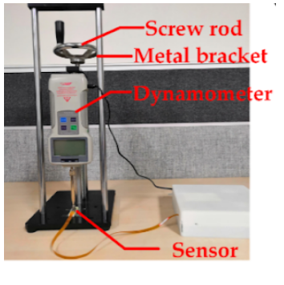
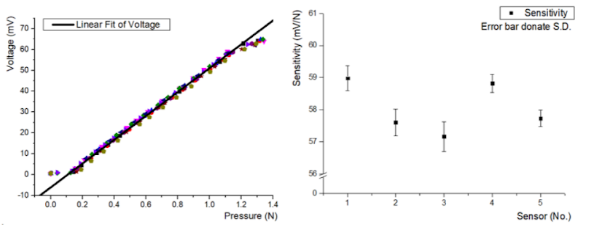

# Calibración del sensor empaquetado

Fue necesario que se empleara un equipo de calibración para hacer una prueba del sensor usando ciertas condiciones estándares, y así probar su rendimiento. Lo que se pudo notar fue que la salida de voltaje del sensor variaba dependiendo de la presión que se le fuera ejercida; puesto de otra forma, si se trataba de una presión leve o fuerte, la linealidad de ésta se esfumaba en condiciones reales. 
En dicho experimento se realizó un ajuste manual del atornille de la varilla en un soporte de metal, en donde el control deslizante en el riel guía se movió hacia arriba y abajo, este control tiene un dinamómetro fijado que cuando contacta con el sensor hace posible que la interacción entre el dinamómetro y el sensor se puedan medir de forma directa.

Con el fin de realizar el testeo se utilizaron 6 sensores, los cuales fueron probados 10 veces, además de que para poder ajustar los datos de prueba en el trazo directo e inverso (linealmente) se usó el método de mínimos cuadrados, para obtener la línea de regresión, que representa la sensibilidad en cada sensor.
El diámetro de la superficie de contacto entre el sensor MEMS y el El sensor del dinamómetro era de aproximadamente 4 mm, y el rango efectivo de presión era de aproximadamente 0.1-1.15 N, por lo que el rango de presión que el sensor pudo detectar fue de aproximadamente 7.96–91.51 KPa. La sensibilidad promedio de los seis sensores fue de aproximadamente 58.06 mV / N, y el La desviación estándar de la sensibilidad de los seis sensores fue de 0,71 mV / N.

[<- Portada](README.md)
||||
[Aplicaciones ->](Aplicaciones.md)
