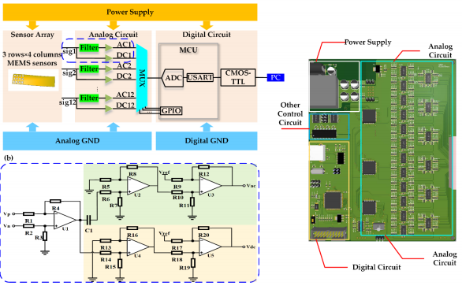

# Hardware

Esto es lo que tiene la arquitectura del dispositivo:

El sistema de circuito está compuesto por un circuito analógico y un circuito digital; su diagrama esquemático se muestra en la Figura. Cada conjunto compuesto por 12 sensores emitió 12 señales diferenciales, luego cada uno de ellos se filtró y amplificó, generando una señal de voltaje de CA (Vac) y una señal de voltaje de CC (Vdc). En la unidad de microcontrolador (MCU), los ADC eran demasiado pocos para muestrear señales de 24 canales (señales de 12 Vca y 12 VCC) al mismo tiempo. Como solo se usó un ADC para recolectar señales de 24 canales, el multiplexor convirtió las señales en una señal y se sondearon las señales de 24 canales para muestreo. Cada vez que se completaba el sondeo, una trama de datos formada por las 24 señales muestreadas eventualmente se transmitía a la PC. La frecuencia de muestreo del sistema era tan alta como 218 Hz, mucho más alta que la señal de onda de pulso.

# Componentes

Un sensor de presión es un instrumento compuesto por un elemento detector de presión con el que se determina la presión real aplicada al sensor (utilizando distintos principios de funcionamiento) y otros componentes que convierten esta información en una señal de salida.
Sensores: son dispositivos MEMS diseñados para medir cambios en el ambiente. Estos microsistemas incluyen sensores químicos, de movimiento, inerciales, térmicos y ópticos.
Chip sensor de presión MEMS, que se usa ampliamente en entornos de presión atmosférica no corrosivos, no conductores y tiene buena repetibilidad y largo plazo estabilidad. El rango de medición es más extenso que el rango de variación de la fuerza estática, y el areade del sensor es lo suficientemente pequeña como para obtener una matriz de alta densidad. 
El conjunto de sensores transduce la presión en una señal de voltaje. La señal detectada se divide en fuerza estática y onda de pulso dinámico a través de un filtro de paso bajo, y luego se amplifican por separado. Finalmente, las señales se transmiten al terminal y se restauran a una onda de pulso 3D en tiempo real, el ancho y la amplitud bajo diferentes fuerzas estáticas se calcularán y se mostrarán en la GUI inmediatamente después.

Los datos del mundo real son analógicos. Por lo tanto, los sensores suelen proporcionar datos analógicos en forma de voltaje (por ejemplo, 0V-5V) y la mayoría de las veces estos datos se transforman posteriormente en datos digitales.
En una aplicación inteligente, los datos de los sensores pueden ser analizados por el cerebro de una unidad de microcontrolador (MCU) que es una unidad central de procesamiento (CPU). Pero la CPU sólo puede entender la información digital. Por lo tanto, es necesario tener un convertidor de analógico a digital (ADC) como interfaz entre los datos del sensor y la CPU para transformar la información analógica en información digital.

Existen muchos tipos de arquitecturas ADC en el mercado (por ejemplo, flash, registro de aproximación sucesiva, canalización y sigma-delta). 
Al estar leyendo las especificaciones creemos que estos fueron algunos de los componentes que utilizaron: el ADuC7023 que es un microcontrolador (MCU) de 16 bits/32 bits con convertidores de analógico a digital (ADC) multicanal de 12 bits y memoria Flash/EE en un solo chip. EL ADC consiste de hasta 12 entradas de extremo único. Cuatro entradas adicionales están disponibles pero son multiplexadas con los cuatro pines de salida del DAC. El ADC puede operar en modo de entrada única o diferencial. 
El multiplexor (MUX) es un circuito combinacional que tiene varios canales de datos de entrada y solamente un canal de salida. Sólo un canal de la entrada pasará a la salida y este será el que haya sido escogido mediante unas señales de control.
La cantidad de líneas de control que debe de tener el multiplexor depende del número de canales de entrada. 

[<- Portada](README.md)
||||
[Funcionamiento de Software ->](Software.md)
